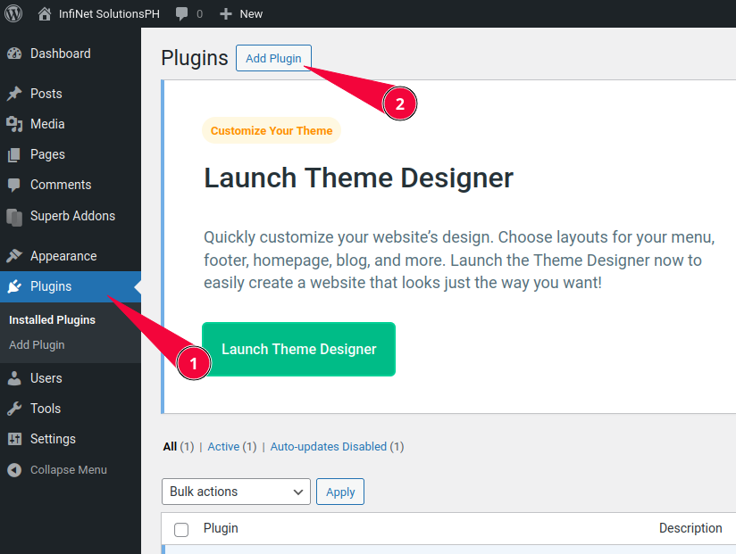
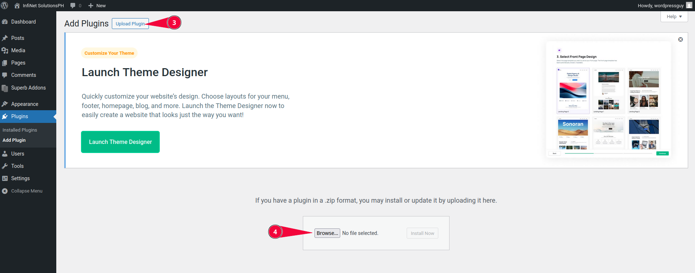
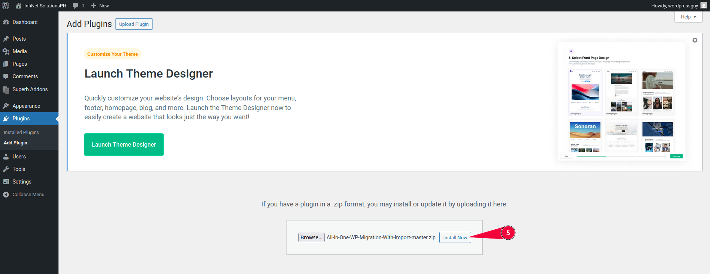
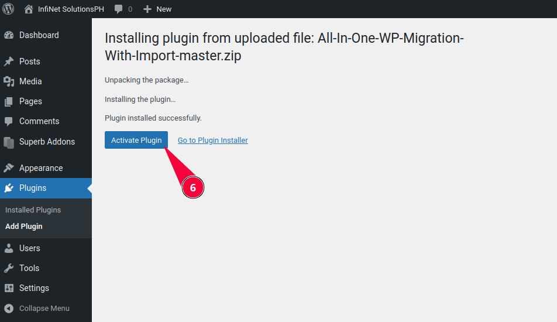
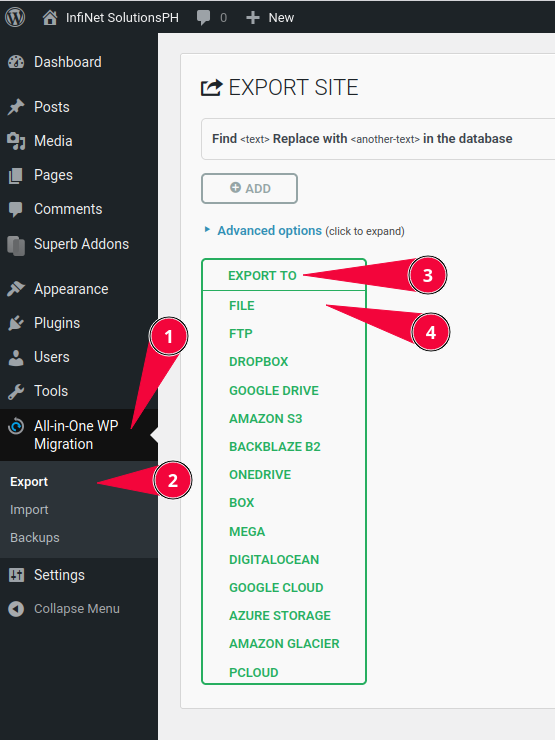
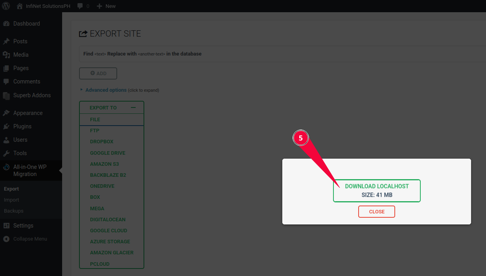
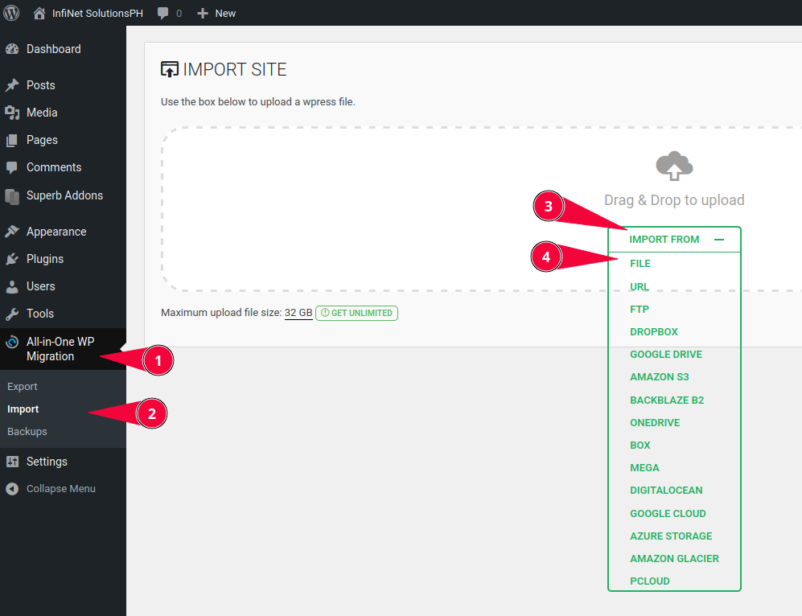
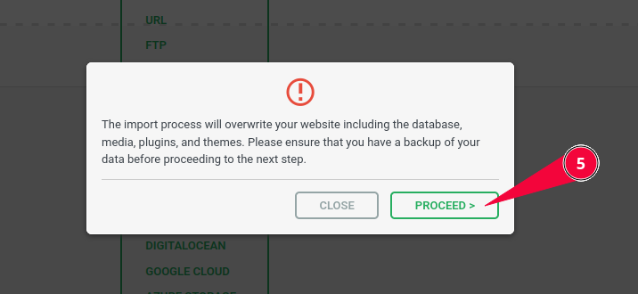
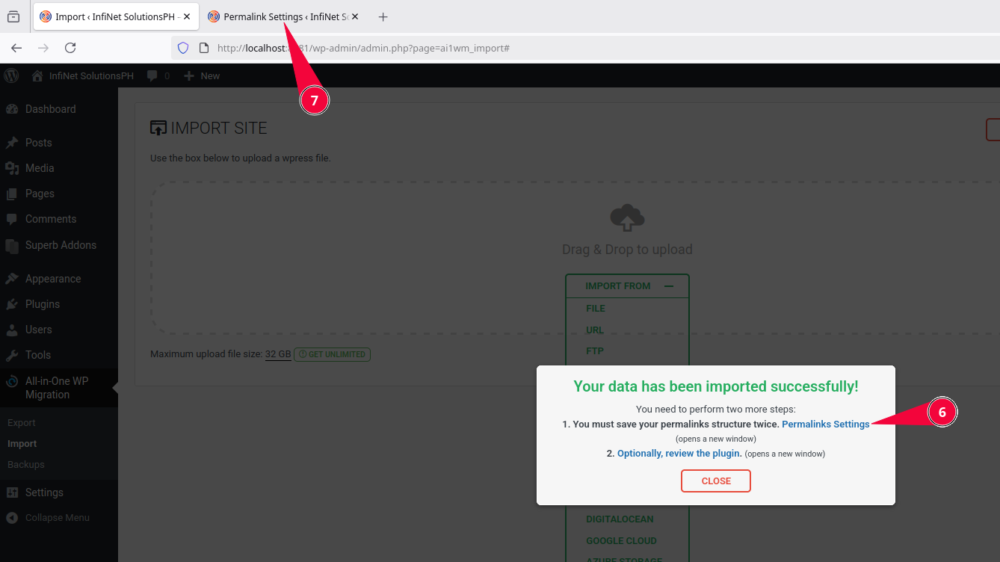
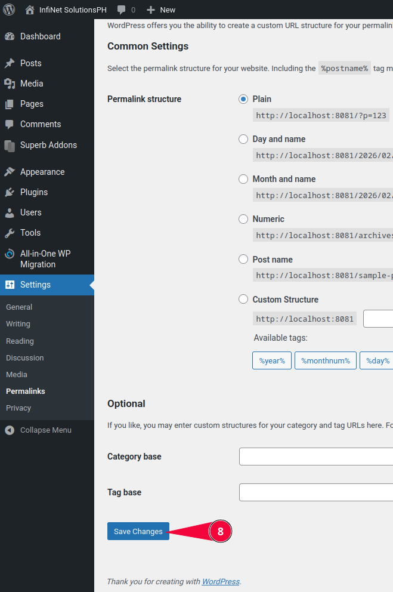

# Wordpress

We use Wordpress to host the [company landing page](https://infinetsolutionsph.com/).

## Developing locally

Developing locally is great and efficient way of building websites, but due to the nature of Wordpress, remote collaboration capabilities is limited.

### Docker Compose

We mainly use the [Docker Engine](https://docs.docker.com/engine/install) with [Docker Compose](https://docs.docker.com/compose/install/) for local development. The following `docker-compose.yml` file uses [Wordpress](https://hub.docker.com/_/wordpress) and [MySQL](https://hub.docker.com/_/mysql) docker images.

```yaml title="docker-compose.yml"
services:
  wordpress:
    image: wordpress
    restart: always
    ports:
      - 8081:80 #  Access Wordpress at http://localhost:8081.
        #  Change 8081 to a different port if needed.
    environment:
      WORDPRESS_DB_HOST: db     # Change these credentials for security purposes
      WORDPRESS_DB_USER: exampleuser
      WORDPRESS_DB_PASSWORD: examplepass
      WORDPRESS_DB_NAME: exampledb
    volumes:
      - wordpress:/var/www/html

  db:
    image: mysql:8.0
    restart: always
    environment:
      MYSQL_DATABASE: exampledb # Change these credentials for security purposes
      MYSQL_USER: exampleuser
      MYSQL_PASSWORD: examplepass
      MYSQL_RANDOM_ROOT_PASSWORD: "1"
    volumes:
      - db:/var/lib/mysql

volumes:
  wordpress:
  db:
```

!!! example "Usage Example"

    ```bash title="Command Line"
    docker compose up -d
    ```

    Make sure that the `docker-compose.yml` file is in the same working directory when composing up.
    Composing up builds and runs the containers. Once finished building and everything is healthy, Wordpress should be accessible at `http://localhost:8081`


## User Interface

We use [Lucide](https://lucide.dev/) for UI icons. An in-depth styling and theming documentation is found [here](../branding/index.md).

## Backups & Migrations

We use the [All-in-One WP Migration](https://github.com/d0n601/All-In-One-WP-Migration-With-Import) plugin to backup and migrate our Wordpress website.

### Installing the Plugin

To use the plugin, we must first [download the plugin](https://codeload.github.com/d0n601/All-In-One-WP-Migration-With-Import/zip/refs/heads/master) and then proceed with the following tutorial to install it.

=== "Step 1-2"

    1) Navigate to the `Plugins` page at the Wordpress dashboard.

    2) Click `Add Plugin`.

    

=== "Step 3-4"

    3) Click `Upload Plugin`.

    4) Upload the file `All-In-One-WP-Migration-With-Import-master.zip`.

    

=== "Step 5"

    5) Click `Install Now`

    

=== "Step 6"

    6) Click `Activate Plugin`

    

    Done!

### Exporting a backup

Performing backups regularly is essential to prevent minimal data loss whenever our hosting service fails and destroys our data or a irreversible destructive update to the website corrupts the data. The following tutorial demonstrates how to export a backup.

=== "Step 1-4"

    1) Navigate to the `All-in-One WP Migration` plugin page at the Wordpress dashboard.

    2) Navigate to `Export`.

    3) Click `EXPORT TO`.

    4) Click `FILE`.

    

=== "Step 5"

    6) Click `DOWNLOAD <SITE DOMAIN>`. The site domain is at what domain name the Wordpress website uses.

    

    Done!

### Importing a backup

Importing a backup is used for restoring Wordpress from a backup file.

=== "Step 1-4"

    1) Navigate to the `All-in-One WP Migration` plugin page at the Wordpress dashboard.

    2) Navigate to `Import`.

    3) Click `IMPORT FROM`.

    4) Click `FILE` and select the backup file, it should be a `.wpress` file.

    

=== "Step 5"

    !!! warning

        Make sure the data you are replacing right now is backed up otherwise proceed if it doesn't need to be backed up. Read the [relevant documentation](#exporting-a-backup) to backup your data.

    5) Click `PROCEED >`.

    

=== "Step 6-7"

    6) A popup will appear and click `Permalink Settings`.

    7) Navigate to the new tab that just opened.

    

=== "Step 8"

    8) Scroll to the bottom and click `Save Changes` twice.

    

    Done!


### Migrating Wordpress

To migrate a Wordpress instance, simply export a backup file of the source Wordpress instance, then import that backup file into the target Wordpress instance. Read the relevant documentation for [exporting](#exporting-a-backup) and [importing](#importing-a-backup) backups to learn more.