# Wordpress

We use Wordpress to host the [company landing page](https://infinetsolutionsph.com/).

## Developing on GreenGeeks

This is the preferred approach to developing the company website. We use [GreenGeeks](https://www.greengeeks.com/) as our Wordpress provider and host.

We continously develop on the staging website https://test.infinetsolutionsph.com. This makes remote and synchronous collaboration easy. Be sure to back up the production website https://infinetsolutionsph.com when migrating/importing changes from the staging website. Learn about backups by reading the [relevant documentation](#backups--migrations).

## Developing locally

Developing locally is great and an efficient way of building websites, but due to the nature of Wordpress, remote collaboration capabilities is limited.

### Docker Compose

We mainly use the [Docker Engine](https://docs.docker.com/engine/install) with [Docker Compose](https://docs.docker.com/compose/install/) for local development. 

We follow this comprehensive [repository](https://github.com/nezhar/wordpress-docker-compose) to locally develop a Wordpress website. Make sure to clone it and place it in an appropriate working directory. It is a must to read the sections Configuration, Installation and Usage (Starting/Stopping containers) in its `README.md` tutorial. The repository uses [Wordpress](https://hub.docker.com/_/wordpress), [MySQL](https://hub.docker.com/_/mysql) and [phpMyAdmin](https://hub.docker.com/_/phpmyadmin) docker images.

## User Interface

We use the [Astra theme with the Galatic Template](https://wpastra.com/templates/galatic-02/) as a base theme and extend and edit the theme from there. An in-depth branding documentation is found [here](../branding/index.md). We also use [Elementor](https://elementor.com/) build websites faster by using various built-in features and elements for free.

### Additional CSS

The following CSS is our `Additional CSS`.

```css
/* Custom Button Styling */
.wp-block-button__link {
  color: white;
  display: inline-flex;
  align-items: center;
  justify-content: center;
  gap: 0.5em;
}

/* Base Lucide Style */
.lucide-base {
  min-width: 1.2em;
  min-height: 1.2em;
  width: 1.2em;
  height: 1.2em;
  background-color: currentColor;
}

/* Hide the Title in websites that use Elementor */
h1.entry-title {
  display: none;
}
```

#### Theme

We use [WindPress](https://wind.press/) for [TailwindCSS](https://tailwindcss.com/) integration.

The following CSS is a class based styling for various elements specifically for the [branding](../branding/index.md) theme of the company.

```css

:root {
  --primary: oklch(70.5% 0.213 47.604); /* orange-500 */
  --secondary: oklch(62.3% 0.214 259.815); /* blue-500 */
}

/* PRIMARY */
.bg-primary { background-color: oklch(95.4% 0.038 75.164); } /* orange-100 */
.text-primary-foreground { color: var(--primary) }
.stroke-primary-foreground { stroke: var(--primary) }
.border-primary { border-color: var(--primary) }

/* SECONDARY */
.bg-secondary { background-color: oklch(93.2% 0.032 255.585); } /* blue-100 */
.text-secondary-foreground { color: var(--secondary); }
.stroke-secondary-foreground { stroke: var(--secondary); }
.border-secondary { border-color: var(--secondary); }

/* NEUTRAL */
.bg-background { background-color: #ffffff; }
.text-foreground { color: #000000; }
.bg-card { background-color: oklch(97% 0.001 106.424); } /* stone-100 */
.text-card-foreground { color: #000000; }
.bg-popover { background-color: #ffffff; }
.text-popover-foreground { color: #000000; }

/* MUTED */
.bg-muted { background-color: oklch(97% 0 0); } /* neutral-100 */
.text-muted-foreground { color: oklch(70.8% 0 0); } /* neutral-400 */
.stroke-muted-foreground { stroke: oklch(70.8% 0 0); } /* neutral-400 */
.border-muted { border-color: oklch(92.2% 0 0); } /* neutral-200 */

/* SUCCESS Admonition */
.bg-destructive { background-color: oklch(93.6% 0.032 17.717); } /* red-100 */
.text-destructive-foreground { color: oklch(57.7% 0.245 27.325); } /* red-600 */
.stroke-destructive-foreground { stroke: oklch(57.7% 0.245 27.325); } /* red-600 */
.border-destructive { border-color: oklch(70.4% 0.191 22.216); } /* red-400 */

/* SUCCESS Admonition */
.bg-success { background-color: oklch(96.2% 0.044 156.743); } /* green-100 */
.text-success-foreground { color: oklch(62.7% 0.194 149.214); } /* green-600 */
.stroke-success-foreground { stroke: oklch(62.7% 0.194 149.214); } /* green-600 */
.border-success { border-color: oklch(79.2% 0.209 151.711); } /* green-400 */

/* WARNING Admonition */
.bg-warning { background-color: oklch(95.4% 0.038 75.164); } /* orange-100 */
.text-warning-foreground { color: oklch(57.7% 0.245 27.325); } /* orange-600 */
.stroke-warning-foreground { stroke: oklch(57.7% 0.245 27.325); } /* orange-600 */
.border-warning { border-color: oklch(70.4% 0.191 22.216); } /* orange-400 */

/* INFO Admonition */
.bg-info { background-color: oklch(93.2% 0.032 255.585); } /* blue-100 */
.text-info-foreground { color: oklch(54.6% 0.245 262.881); } /* blue-600 */
.stroke-info-foreground { stroke: oklch(54.6% 0.245 262.881); } /* blue-600 */
.border-info { border-color: oklch(70.7% 0.165 254.624); } /* blue-400 */   

/* TIP Admonition */
.bg-tip { background-color: oklch(95.3% 0.051 180.801); } /* teal-100 */
.text-tip-foreground { color: oklch(60% 0.118 184.704); } /* teal-600 */
.stroke-tip-foreground { stroke: oklch(60% 0.118 184.704); } /* teal-600 */
.border-tip { border-color: oklch(77.7% 0.152 181.912); } /* teal-400 */
```

### Icons

We use [Lucide](https://lucide.dev/) for UI icons. However, Elementor integrates freemium [Font Awesome](https://fontawesome.com/) icons by default so you can also choose from there.

#### Manually adding an icon

We can manually add a new icon to accompany buttons or to help important text standout more.

##### Using an SVG

The easiest way of inserting an icon is by using an HTML block, and inserting the SVG from there. Be mindful of the element classes, stroke color, and fill color as they are what often causes visual error or the icon might not look right.

However, it may be impossible to use an SVG block within buttons as capabilities of button editing are limited. You may instead use the built-in Font Awesome integration or ask an administrator to place/upload an SVG image for you. 

##### Class based

!!! warning

    This method requires administrator access to the theme settings

The following is a generic CSS icon class using the data URL of a Lucide icon.

```css
.icon-generic {
  mask: url("data:image/svg+xml;base64,...") no-repeat center;
  mask-size: contain;
}
```


Simply replace the `mask: url("...")` value with the data URL of your chosen icon then add this class to `Additional CSS`.
Then use both the `lucide-base` and `.icon-generic` class in an empty `div`'s class attribute.

!!! example "Demonstration"

    As a demonstration example, let's try adding this [heart icon](https://lucide.dev/icons/heart) to our website.

    === "Step 1-2"

        1) Navigate to the heart icon page and click the dropdown menu for copy options.

        2) Click `Copy Data URL`.

        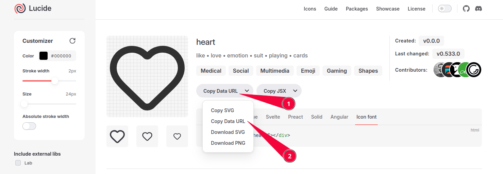

    === "Step 3"

        3) Head over to the `Site Editor` page.

        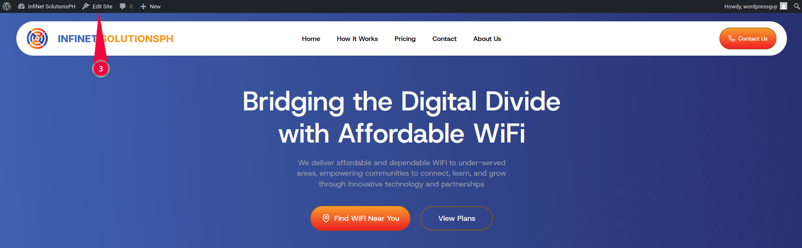

    === "Step 4-6"

        4) At the `Design` page, head over to `Styles`

        5) Click the dropdown options

        6) Click `Additional CSS`

        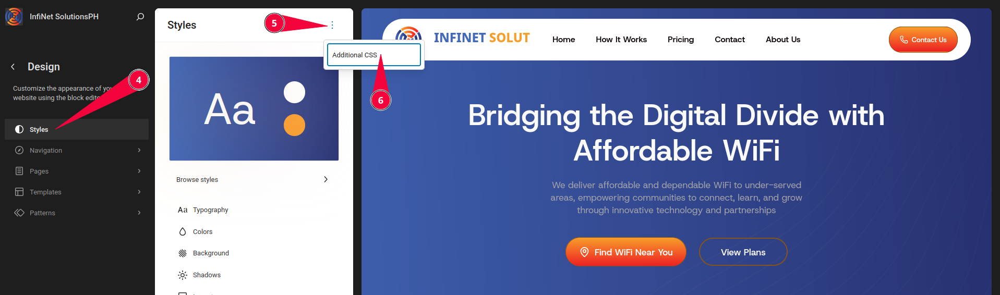

    === "Step 7"

        7) Prepare the CSS class and replace the `mask: url("...")` value with the data URL that you just copied. We appropriately name the class `.icon-heart`.

        ```css
        .icon-heart {
          mask: url("")
            no-repeat center;
          mask-size: contain;
        }
        ```

        !!! tip

            Prepare the CSS class with your favorite text editor as the ones inside Wordpress is quite limited.


    === "Step 8"

        8) Copy and paste the `.icon-heart` CSS class into `Additional CSS`. Now we are ready to use this icon.

        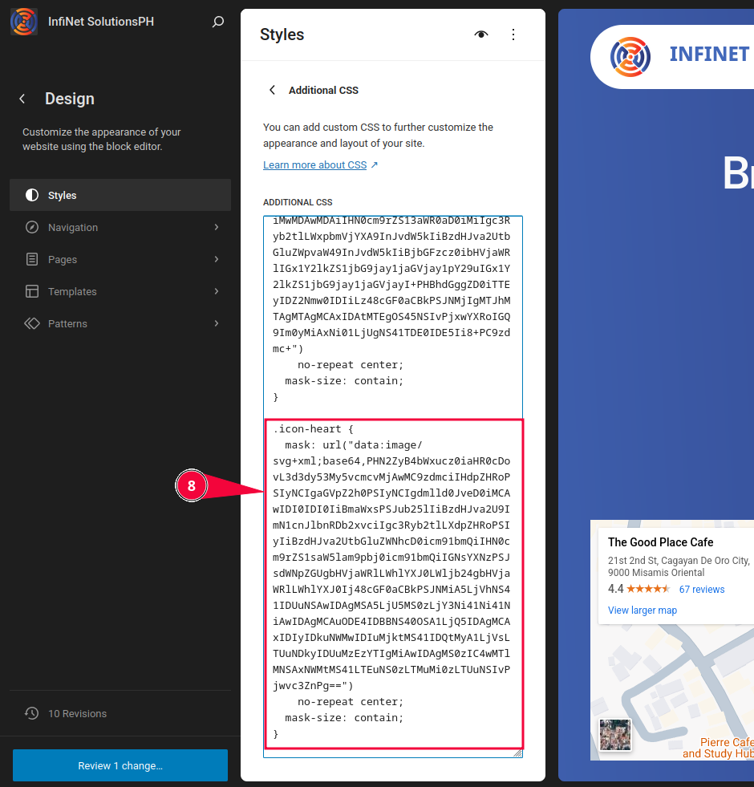


    === "Step 9-11"

        9) Pick your chosen block to insert your icon. We choose this `View Plans` button.

        10) Click the dropdown options

        11) Click `Edit as HTML`

        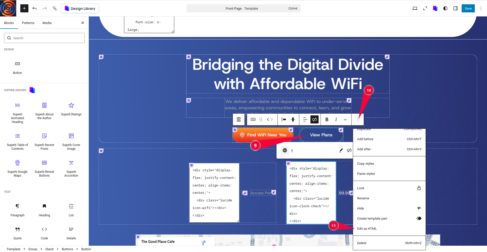

        !!! tip

            You can also alternatively use this with the `HTML` block.

    === "Step 12-13"

        12) Insert an empty `div` element and add class attributes `lucide` and `icon-heart`.

        13) Click `Edit visually` to see the results.

        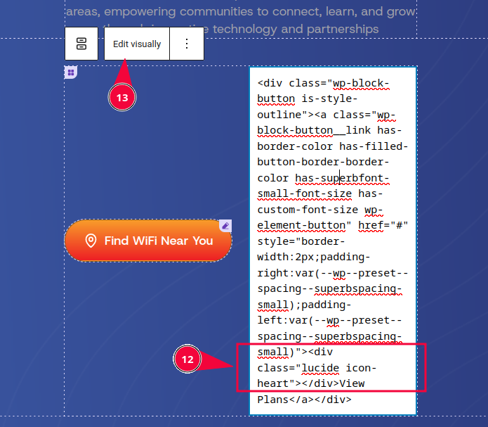

        Done!

        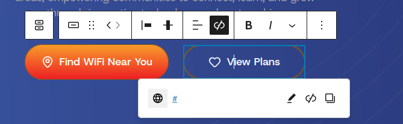

## Backups & Migrations

We use the [All-in-One WP Migration](https://github.com/d0n601/All-In-One-WP-Migration-With-Import) plugin to backup and migrate our Wordpress website.

### Installing the Plugin

To use the plugin, we must first [download the plugin](https://codeload.github.com/d0n601/All-In-One-WP-Migration-With-Import/zip/refs/heads/master) and then proceed with the following tutorial to install it.

=== "Step 1-2"

    1) Navigate to the `Plugins` page at the Wordpress dashboard.

    2) Click `Add Plugin`.

    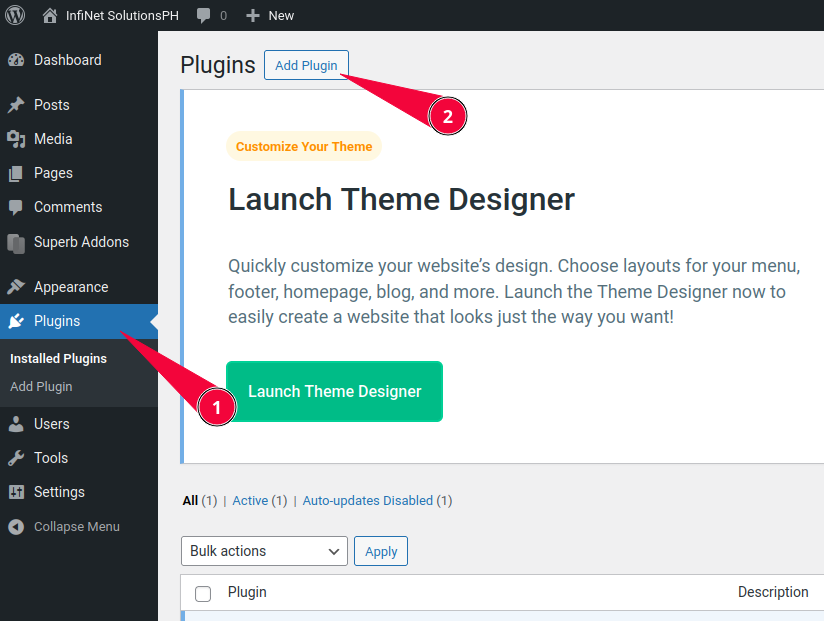

=== "Step 3-4"

    3) Click `Upload Plugin`.

    4) Upload the file `All-In-One-WP-Migration-With-Import-master.zip`.

    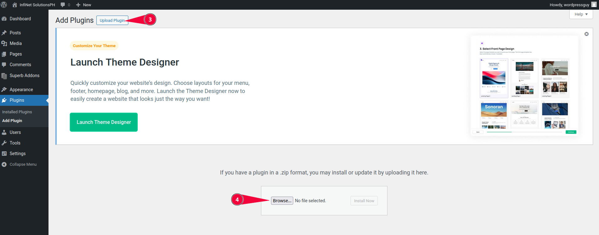

=== "Step 5"

    5) Click `Install Now`

    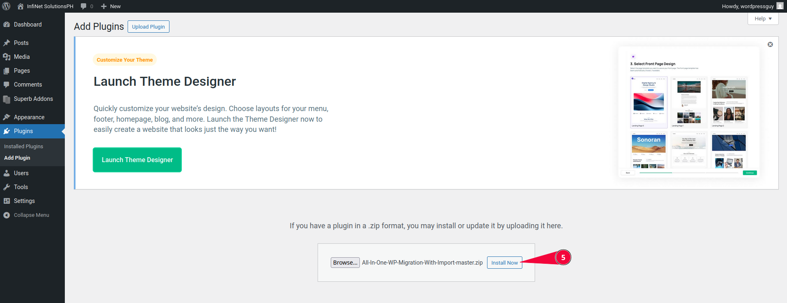

=== "Step 6"

    6) Click `Activate Plugin`

    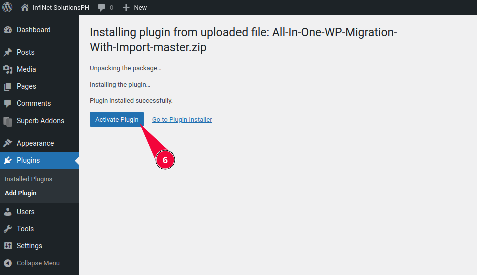

    Done!

### Exporting a backup

Performing backups regularly is essential to prevent minimal data loss whenever our hosting service fails and destroys our data or a irreversible destructive update to the website corrupts the data. The following tutorial demonstrates how to export a backup.

=== "Step 1-4"

    1) Navigate to the `All-in-One WP Migration` plugin page at the Wordpress dashboard.

    2) Navigate to `Export`.

    3) Click `EXPORT TO`.

    4) Click `FILE`.

    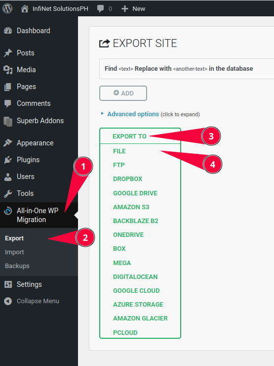

=== "Step 5"

    6) Click `DOWNLOAD <SITE DOMAIN>`. The site domain is at what domain name the Wordpress website uses.

    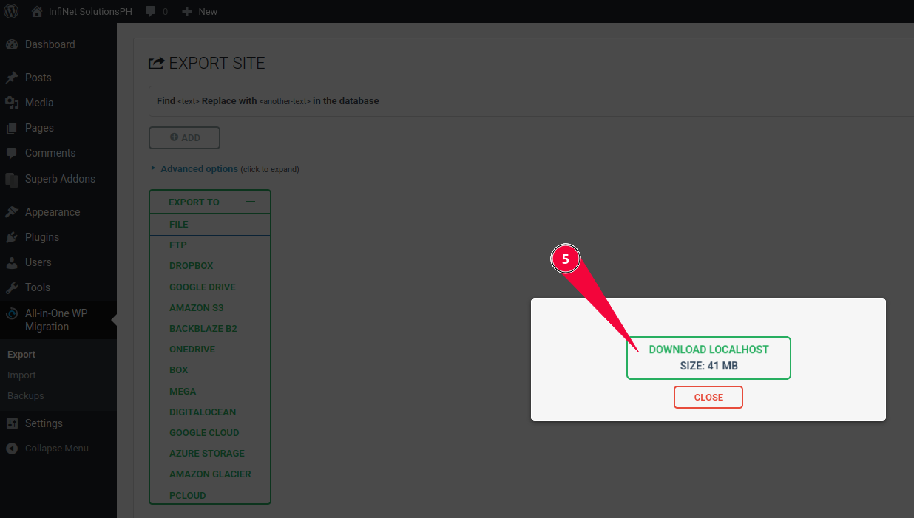

    Done!

### Importing a backup

Importing a backup is used for restoring Wordpress from a backup file.

=== "Step 1-4"

    1) Navigate to the `All-in-One WP Migration` plugin page at the Wordpress dashboard.

    2) Navigate to `Import`.

    3) Click `IMPORT FROM`.

    4) Click `FILE` and select the backup file, it should be a `.wpress` file.

    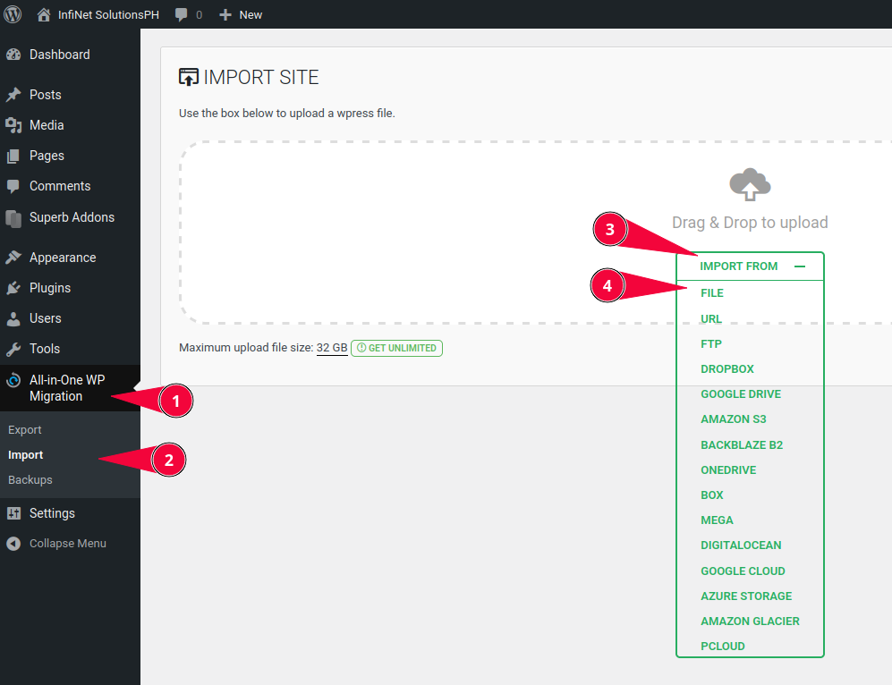

=== "Step 5"

    !!! warning

        Make sure the data you are replacing right now is backed up otherwise proceed if it doesn't need to be backed up. Read the [relevant documentation](#exporting-a-backup) to backup your data.

    5) Click `PROCEED >`.

    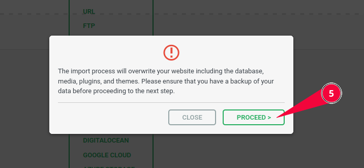

=== "Step 6-7"

    6) A popup will appear and click `Permalink Settings`.

    7) Navigate to the new tab that just opened.

    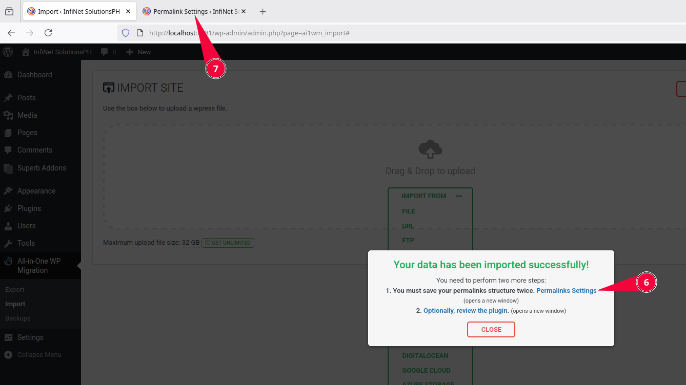

=== "Step 8"

    8) Scroll to the bottom and click `Save Changes` twice.

    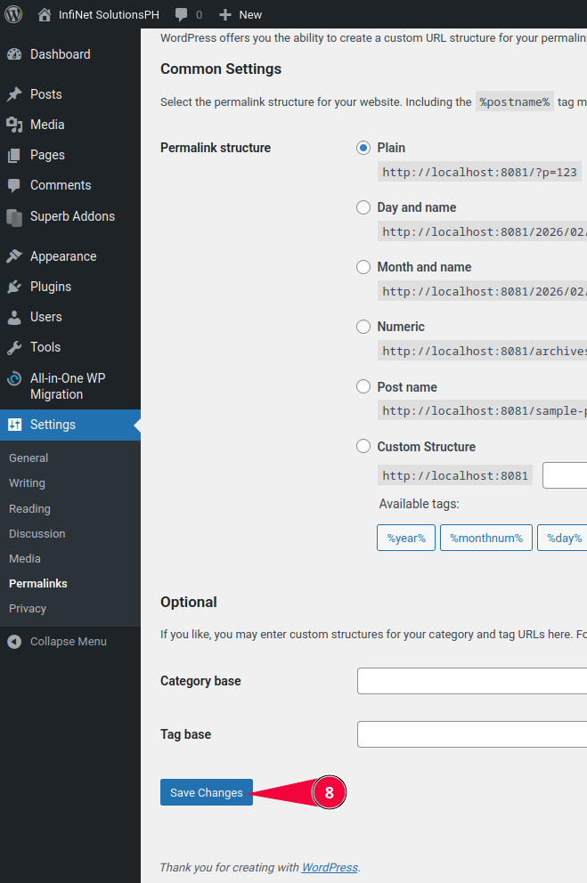

    Done!

### Migrating Wordpress

To migrate a Wordpress instance, simply export a backup file of the source Wordpress instance, then import that backup file into the target Wordpress instance. Read the relevant documentation for [exporting](#exporting-a-backup) and [importing](#importing-a-backup) backups to learn more.

## Voucher Vendors Locator

This section discusses how to maintain the Leaflet voucher vendor locator feature of the Wordpress website. Main maintenance tasks outlined are:

1. How to add a vendor using [QGIS](https://qgis.org/)

### Adding Vendors

#### Plotting in QGIS

We use QGIS to easily add vendors on the map.

=== "Step 1-3"

    1) Clone the [landing-page repository](https://github.com/ELEISS-OPC/landing-page).
    
    2) Open a new project in QGIS.
    
    3) Import the file `voucher-stores.geojson` into the `Layers` panel. You can do this easily with Drag & Drop.

=== "Step 4-8"

    4) Using the MapTiler QGIS plugin, click `Browser Panel > MapTiler > OpenStreetMap` to load the [OpenStreetMap](https://www.openstreetmap.org/) map tileset.

    5) With the `voucher-stores` layer selected, click `Toggle Editing`.

    6) Then click `Add Point Feature` to begin adding vendors on the map as point features.

    7) Click on the map where the vendor is located.

    8) Input the necessary metadata.

=== "Step 9-10"

    9) Click `Save Layer Edits` to save the new point feature(s) added to the layer.

    10) Make sure to commit and push the changes you've made in the landing-page repository.

#### Updating the Wordpress map

Once you're done plotting in QGIS, upload the updated `vendor-stores.geojson` and replace the old one in the Wordpress media library.
