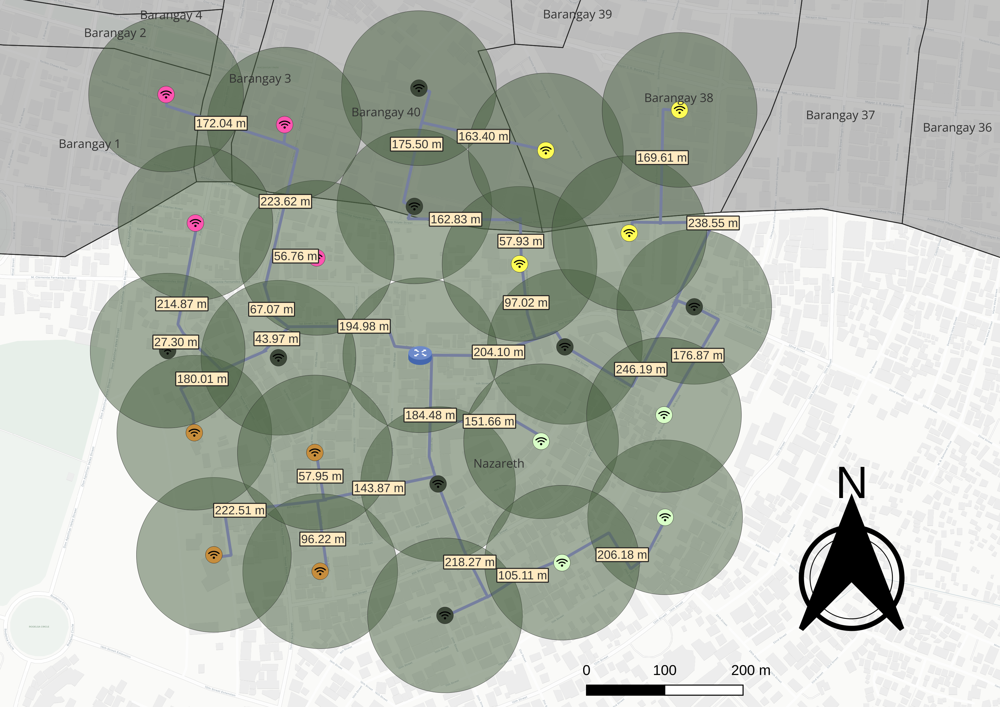

# Network

## Distribution of Hubs/Switches

### Criterias for distribution optimization

The following criterias are prioritized in order:

1. Continuous coverage - The network must have as little dead spaces as possible.
2. Maximum area coverage - The network should aim to cover the maximum amount of area it can possibly cover.
3. Wire length - The wire length between nodes must be between 1-250 meters inclusive.
4. The wires should follow the road by default. Should a representative of a private residence/commercial property allow the right for wires to go through, and it is optimal to do so, then pass the wires through the property.

### Node naming scheme

Each node[^1] should be identified using its code. This code describes the node's geographical location and position relative to the main hub/router.

The code we use for identifying nodes has a specific format. Each element should be capitalized and must have 3 or 4 alphanumeric characters to describe it. All elements are dash `-` separated.

The code has 11 elements which concern with 11 types of information and these are the following, in this particular order:

| Order | Information                   | Description                                                                                                                                                                                         |
| ----: | ----------------------------- | --------------------------------------------------------------------------------------------------------------------------------------------------------------------------------------------------- |
|     1 | Country                       | [ISO 3166-1 alpha-3](https://en.wikipedia.org/wiki/List_of_ISO_3166_country_codes) code of the country where the site or network location is situated. Default: `PHL`                               |
|     2 | Archipelago                   | The archipelago group (e.g., `LZN`, `VSY`, `MND`)                                                                                                                                                   |
|     3 | Region                        | The letter `R` first for the Region and the two digits. Example: `R10` for Region 10                                                                                                                |
|     4 | Province                      | The province within the region. Use the first 3 consonants, except the 1st letter OR first consonant if with second word, consider the first and second letters of the 2nd word.                    |
|     5 | City/Town                     | The city or municipality. Use first 3 consonants, except the 1st letter is vowel.                                                                                                                   |
|     6 | Barangay/Village              | The barangay or village where the site is located. Use the first 3 consonants, except the 1st letter.                                                                                               |
|     7 | Main/Front Street/Purok       | The primary street, road, or local area (purok). The closest street where the hub is located. Use the first four letters or direct if the name of Purok is like Purok Waling-waling, consider WALI. |
|     8 | Hub Type                      | Type of hub (e.g., `MHB`, `1HB`, `2HB` for main hub, 1st hub, 2nd hub respectively).                                                                                                                |
|     9 | Location/Direction            | Relative cardinal or intermediate directional description (e.g., `CTR`, `NOE`, `SOE`, `NOW`)                                                                                                        |
|    10 | Distance from Main Hub/Router | Distance between this site and the main hub or router. +/-50 meters from the exact/indicated point.                                                                                                 |
|    11 | Unit (meters or kilometers)   | Measurement unit used for the distance. i.e `SQM`, `SKM`, or `STR` for straight.                                                                                                                    |

[^1]: A node represents a router or access point.

!!! Example

    `PHL-MND-R10-MOR-CGY-NZR-21ST-MHB-CTR-000-SQM` which stands for Philippines, Mindanao, Region 10, Misamis Oriental, Cagayan de Oro City, Nazareth, 21st Street, Main Hub, Center, 0 meters distance, square meters.

## Diagram

<!-- TODO: Add a reference to this schematic -->

We use the official proposal schematic for reference and [QGIS](https://qgis.org/) is used for formulating diagrams for implementing a network. Particularly relating to information on point-to-point distances for wire length estimation and hub location & service ranges. This information is integrated with satellite/digital maps to better reference real-world variables.

!!! Example

    

## Omada Access Points

To expand the network, we need to install access points throughout the network to serve internet access to our customers. Access Points are network devices that clients can connect to wirelessly using WiFi. Read more about access points in [this Wikipedia article](https://en.wikipedia.org/wiki/Wireless_access_point).

However, we will need a specific type of access points. These access points in particular are [Omada devices](https://www.omadanetworks.com/), which is a set of products by TP-Link. Omada devices' selling point is a focus on the approach of [software-defined networking](https://en.wikipedia.org/wiki/Software-defined_networking). An approach where control and configuration of network devices is centralized using remote controllers.

Omada controllers will have [no control over non-omada devices](https://community.tp-link.com/en/business/forum/topic/599760). Omada devices should only be used with KapitWifi, as they have also specified in their [official tutorial](../kapitwifi/index.md#kapitwifi)
